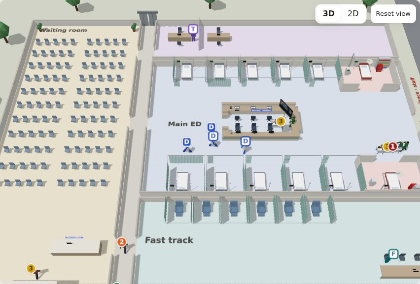
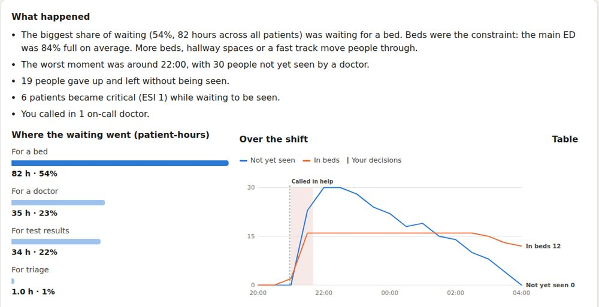
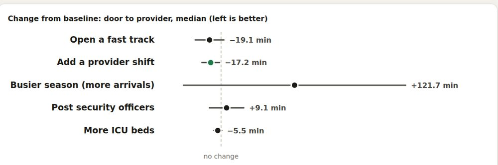

# ER Optimization Game

**[Play it in the browser →](https://hospital-research-game-topaz.vercel.app)**

Run an emergency department: design the layout, staffing, and patient process, then watch a deterministic discrete-event simulation play out in 3D. The same engine runs headless for research (optimizers, baseline policies, a Python Gym-style wrapper) and powers a planning tool that compares what-if changes for a real department.



| End-of-shift debrief | Planner: what-ifs with 95% intervals |
|---|---|
|  |  |

## What's in it

- **Simulation engine** (`packages/sim`): pure TypeScript, no DOM. Non-homogeneous Poisson arrivals, triage with errors, deterioration while waiting, patients leaving without being seen, misdiagnoses with 72-hour bounce-backs, inpatient boarding (ICU / step-down / ward), lab and imaging queues with opening hours, bedside nurse ratios, staff fatigue, security incidents, surges and mass casualties. Every system is a toggleable module.
- **Deterministic:** every run takes a seed. Same seed + config + commands gives byte-identical results, and each patient draws from their own random stream, so changing one thing never reshuffles everyone else (common random numbers).
- **The game** (`apps/game`, React + three.js): 8 story levels (Quiet Night, Monday Morning, Fast Track, Flu Season, Boarding Crisis, Mass Casualty, Budget Mode, The New Build), a career mode, a daily challenge, a sandbox with every module toggle, a floor-plan designer, and "build your own hospital" by drawing rooms on the 3D floor. Debriefs explain the main bottleneck in plain language.
- **Planner** (for hospitals): runs a baseline and what-ifs on the same simulated weeks and reports each KPI as a range plus the paired change with a 95% t interval. Imports one-row-per-visit CSV exports, fits arrivals, acuity mix and admission rates, and checks the model against the data. Includes a root-cause bottleneck finder and a printable report.
- **Research tools** (`packages/research`, `tools/headless`, `python/`): a headless CLI, baseline policies, simulated-annealing search for the best-found setup, a JSON-lines server, and a Python `SimClient` / Gym-style `ErEnv`.

## Validation

The test suite checks the engine against theory, not just itself:

- **Determinism:** same seed → byte-identical metrics.
- **Erlang C:** with all modules off (a single M/M/c queue), simulated mean wait matches the analytic Erlang C formula within tolerance.
- **Little's Law:** average number in system ≈ arrival rate × average time in system.
- **Monotonicity:** more doctors never increase mean wait when boarding is off.
- **Level balance:** each story level's shipped setup fails, its reference solution passes, and the reference beats the shipped setup across other days.

Browser end-to-end tests (`pnpm e2e`) play levels, the planner and the 3D builder in headless Chromium, in light and dark mode and at mobile width.

> **Calibration status.** The defaults now use US national figures from the NHAMCS 2022 emergency department survey (16,025 visits weighted to 155.4 million). These are arrivals by hour and weekday, ambulance share and admitting unit (ICU, step-down, ward) by acuity. The planner's example department and new hospitals in the builder start from a full fit to that survey, which matches 10 of 12 national checks: wait to provider, share leaving unseen, admissions, boarding, and length of stay at every triage level. Fetch and refit with `pnpm headless open-data --source nhamcs-2022 --fetch --set beds.main=32`; see [`docs/open-data.md`](docs/open-data.md). Staffing, costs and other numbers still marked `// PLACEHOLDER` in `packages/sim/src/params.ts` are not calibrated yet. The story levels keep the arrival pattern they were balanced on. The MIMIC-IV-ED demo (222 stays, mostly admitted patients) was fitted too, as a pipeline check only.

## Getting started

Requires Node 20+ and pnpm.

```sh
pnpm install
pnpm game          # browser game (Vite dev server)
pnpm test          # unit + validation tests
pnpm typecheck
pnpm e2e           # build the game and play it in headless Chromium
```

Headless runs:

```sh
pnpm headless run --config configs/examples/basic.json --seed 42 --out results.json
pnpm headless run --config configs/validation/mmc.json --seeds 1-8 --out results.csv
pnpm headless run --config configs/levels/level-02-monday-morning.json --seeds 1-40   # level pass rate
pnpm headless compare --config <baseline.json> --scenarios <scenarios.json> --seeds 1-20   # planner what-ifs
pnpm headless optimize --config configs/levels/level-07-budget-mode.json \
  --space configs/research/space-level7.json --iterations 200
```

Python wrapper: see [`python/README.md`](python/README.md) (`pnpm test:python`).

## Project layout

| Path | What it is |
|---|---|
| `packages/sim` | Simulation engine: events, arrivals, pipeline, modules, metrics, levels, career |
| `packages/research` | Policies, optimizer, planner comparisons, calibration, JSON-lines session |
| `apps/game` | Browser game and planner (React, Canvas 2D, three.js 3D) |
| `tools/headless` | CLI: `run`, `balance`, `benchmark`, `compare`, `calibrate`, `optimize`, `serve` |
| `python/` | Gym-style wrapper and MIMIC-IV-ED calibration (standard library only) |
| `configs/` | Levels, examples, validation, calibration and planner inputs (JSON) |
| `docs/` | Pilot data request and screenshots |

[`CLAUDE.md`](CLAUDE.md) has the full design spec, principles, and implementation decisions.

## Deploying

The game is a static site (the simulation runs in the browser). `vercel.json` builds it from the repo root: import the repo in Vercel and keep the root directory as `./`.
